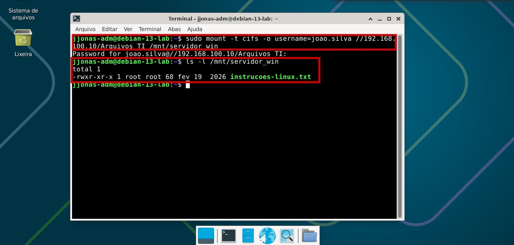
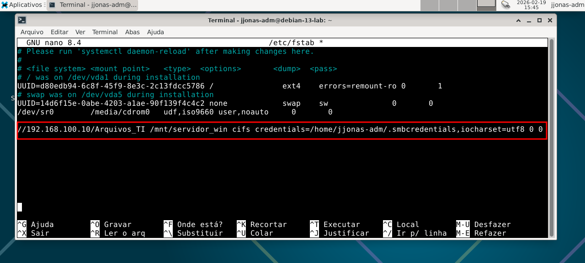

# Nível 2: Interoperabilidade entre Sistemas (Debian + Windows Server)

## Objetivo
Estabelecer uma comunicação funcional e persistente entre uma estação Linux (Debian 13) e um servidor Windows (Active Directory), permitindo o compartilhamento de recursos e arquivos de forma centralizada.

## Tecnologias Utilizadas
* **Protocolo SMB/CIFS:** Para comunicação de arquivos em rede.
* **Pacote cifs-utils:** Ferramenta Linux para suporte ao sistema de arquivos Windows.
* **FSTAB:** Automação de montagem de discos no Kernel Linux.

## Implementação

### 1. Configuração de Rede e Resolução de Nomes
O cliente Debian foi configurado com IP estático para garantir que o Servidor Windows o reconheça. O DNS foi apontado para o Controlador de Domínio para permitir a resolução do nome do domínio `lab.local`.

* **Configuração de IP Fixo e DNS para o Controlado de Domínio**

  

### 2. Mapeamento do Volume de Rede
Criamos um ponto de montagem em `/mnt/servidor_win`. Através do comando `mount`, integramos a pasta compartilhada do Windows diretamente na estrutura de diretórios do Linux.

* **Integração da pasta compartilhada do Windows ao Linux**

  

### 3. Persistência e Segurança
Para que o mapeamento não se perca ao reiniciar a máquina, configuramos o arquivo `/etc/fstab`. As credenciais de acesso foram armazenadas em um arquivo oculto e protegido (`.smbcredentials`) para evitar a exposição de senhas em texto claro.

* **Configuração do arquivo fstab para fixar o mapeamento do volume de rede**

  

## O que este nível agrega ao projeto?
Este nível demonstra que o laboratório não é apenas uma coleção de máquinas isoladas, mas um ecossistema integrado. Agora, usuários do Windows e processos do Linux podem compartilhar a mesma base de dados de forma segura e organizada.
