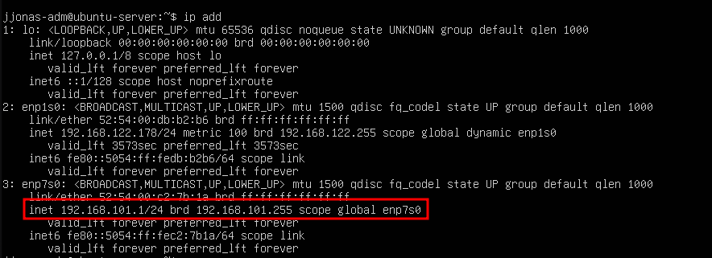
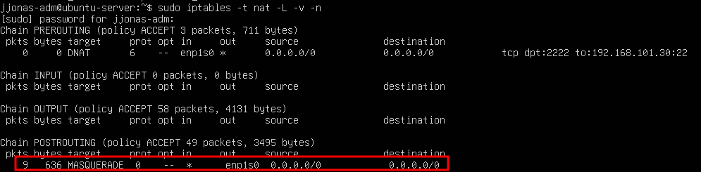
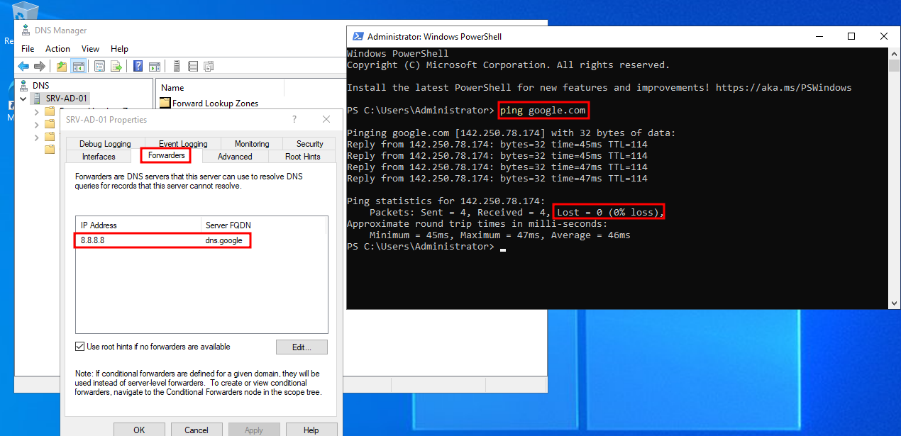
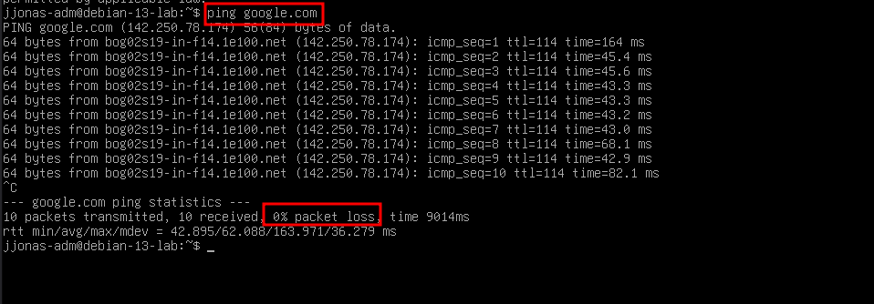

# Nível 3: Gateway Linux e Roteamento entre Redes

Este repositório documenta a implementação de um Gateway Linux (Ubuntu Server) para gerenciar o tráfego de uma rede interna isolada (LAN) com clientes Windows e Debian.

## Arquitetura da Rede
* **Gateway:** Ubuntu Server (WAN DHCP | LAN 192.168.101.1)
* **Clientes:** Windows Server (.10) e Debian 13 (.30) conectados à LAN.

---

## Configuração do Gateway (Ubuntu)

Para transformar o Ubuntu em um roteador funcional, aplicamos três pilares de configuração:

1. **Roteamento de IP:** Ativado no Kernel através do parâmetro `net.ipv4.ip_forward=1` no arquivo `/etc/sysctl.conf`.
2. **Endereçamento Estático:** Interface interna configurada com o IP `192.168.101.1/24` via Netplan.
3. **NAT (Masquerade):** Regra de IPTables para mascarar o tráfego interno, permitindo que a LAN acesse a internet usando o IP da WAN.

> **Vizualização das Interfaces de Rede e Regra Masquerade**
   
   

   

---

## Integração de Clientes

### 1. Windows Server (Active Directory)
Configurado para utilizar o Ubuntu como saída de rede. Para manter a resolução de nomes:
* **Gateway:** 192.168.101.1
* **DNS Forwarders:** Adição do IP 8.8.8.8 no serviço de DNS do Windows para encaminhamento de consultas externas.

### 2. Debian 13 (Interoperabilidade)
O Debian foi configurado para utilizar o Windows Server como servidor DNS primário, garantindo que ele consiga resolver nomes tanto da internet quanto do domínio local.

---

## Seção: Troubleshooting (Resolução de Problemas)

### 1. Resolução de Nomes no Windows Server (DNS)
**Sintoma:** O Windows Server pingava IPs externos (8.8.8.8), mas não resolvia nomes (google.com).
**Causa:** Como o servidor é um Controlador de Domínio, ele tentava resolver nomes de internet sozinho ou via Root Hints, o que falhava devido às restrições da rede.
**Solução:** Configuração de **Encaminhadores (Forwarders)** no console DNS do Windows, apontando para o DNS público do Google (8.8.8.8).

> **Teste de Resolução de Nomes e Navegação no AD**
   
   

### 2. Conflito de Layer 2 (MAC Address e Virtualização)
**Sintoma:** Instabilidade total na conectividade e perda de pacotes intermitente no ambiente virtual.
**Causa:** Conflito de endereçamento no Virt-Manager, onde o tráfego do Gateway era disputado entre a interface virtual do Ubuntu e o adaptador físico do Host (MAC Address duplicado na percepção do switch).
**Solução:** Migração para a sub-rede `192.168.101.0/24`, garantindo o isolamento das interfaces e a unicidade do endereço MAC para o Gateway virtual.

### 3. Debian 13: Persistência da flag "onlink" e Conectividade
**Sintoma:** O comando `ip route` exibe a flag `onlink` para o Gateway padrão.
**Causa:** O sistema interpreta o Gateway como tecnicamente fora da máscara imediata devido a especificidades da virtualização no Debian 13.
**Solução:** Embora a flag persista, a conectividade foi garantida através do `flush` da interface e da aplicação do endereçamento via notação CIDR (/24).

> **Teste de Saída de Rede no Cliente Linux**

   

---

## Próximos Passos
O projeto avança para o **Nível 4**, com a implementação de um Firewall Stateful e políticas de LOG para auditoria de tráfego.
