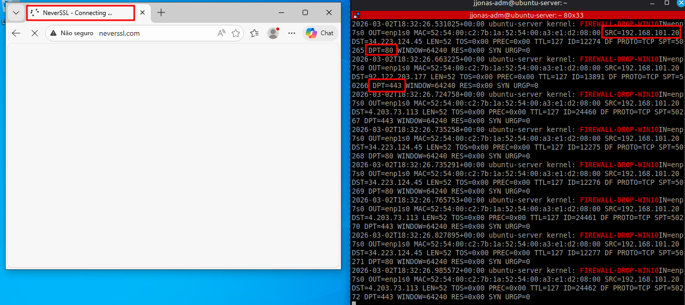
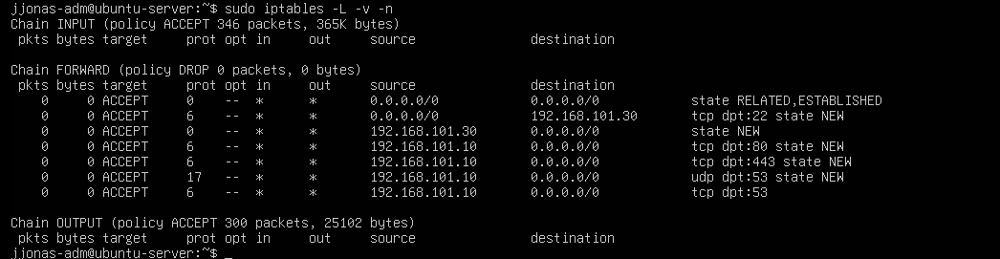
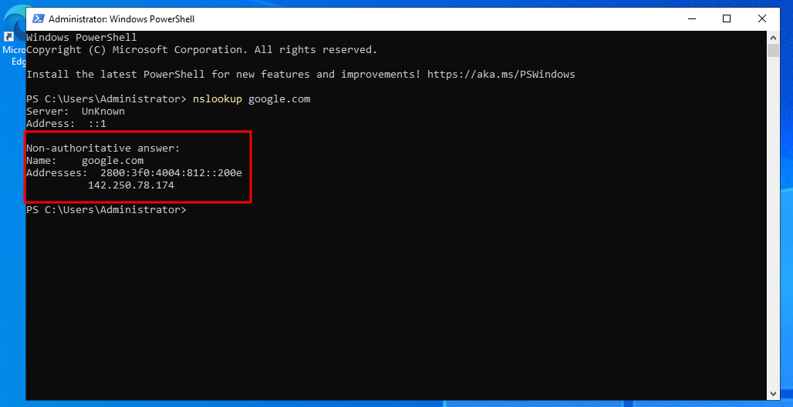

# Nível 4: Segurança Perimetral e Firewall Stateful

Nesta etapa, o Gateway Ubuntu foi transformado em um Firewall Ativo, deixando de apenas rotear pacotes para filtrar rigorosamente o tráfego baseado em estados e protocolos específicos (**Stateful Inspection**).

## Implementação da Política "Default DROP"
Diferente dos níveis anteriores, onde a rede era aberta, aplicamos o conceito de **Privilégio Mínimo**:
1. **INPUT/FORWARD DROP:** Todo tráfego de entrada e passagem é bloqueado por padrão no cabeçalho da Chain.
2. **Stateful Inspection:** Permissão de tráfego de retorno através da regra `ESTABLISHED,RELATED`, garantindo que apenas conexões iniciadas internamente recebam resposta.

## Regras de Acesso e Segmentação
Para manter a operação e a produtividade, criamos exceções granulares por host:

* **Windows Server (.10):** Liberadas portas **53 (UDP/TCP)** para DNS e **80/443 (TCP)** para atualizações e navegação essencial.
* **Debian (.30):** Configurado como host de homologação com **acesso total de saída** (ACCEPT) para testes de novas ferramentas.
* **Acesso Administrativo:** Mantido o redirecionamento (NAT) da porta **2222** para o SSH do Debian.
* **Windows 10 (.20):** Mantido sob bloqueio total (Default DROP) para fins de auditoria e teste de segurança.

---

## Verificação e Troubleshooting

### 1. Bloqueio de ICMP (Ping) e Navegação
**Cenário:** Testes de conectividade via `ping` para o Google agora falham propositalmente, pois o protocolo ICMP não foi incluído nas exceções para evitar a exposição e varredura do Gateway.
**Resultado:** O Windows 10 não navega e não responde ao ping; o Windows Server resolve nomes (DNS), mas também não responde ao ping externo, garantindo invisibilidade básica.

### 2. Auditoria de Segurança (Logs do Firewall)
Configuramos uma regra de LOG personalizada para registrar tentativas de acesso não autorizado vindas do Windows 10.

> **À esquerda, navegador do Win10 com erro de conexão; à direita, terminal do Ubuntu com `tail -f` exibindo o prefixo FIREWALL-DROP-WIN10.**
   

### 3. Persistência e Listagem de Regras
As regras foram aplicadas de forma persistente através do pacote `iptables-persistent`. A tabela abaixo reflete a convivência das diferentes políticas por IP.

> **Comando `sudo iptables -L -v -n` exibindo as exceções do .10, .30 e a política global DROP**
   

### 4. Resolução de Nomes (DNS)
Validação da cadeia de resolução, onde o Windows 10 consulta o Windows Server (.10), e este atravessa o firewall para buscar a resposta na internet através da porta 53 liberada.

> **Prompt do Windows Server executando `nslookup google.com` com sucesso, provando que serviços críticos estão operacionais.**
   

---

## Conclusão da Fase 1
Com o perímetro seguro e as regras segmentadas por host, o laboratório conclui sua fase de infraestrutura de rede básica.

---
**Status do Projeto:** Firewall Consolidado e Documentado.
